```{=html}
<button class="print-btn" onclick="window.print()">&#128424; Print / Save as PDF</button>
```

## Learning Objectives

Upon completion of this handout, you should be able to:

1. Describe the different types of hypersensitivity reactions based on clinical presentation and immunological mechanisms
2. Recognise a patient history that will differentiate between immediate and delayed-type hypersensitivity reactions
3. Describe the risk of cross-reactions between various beta-lactam antibiotics
4. Describe the principles and contraindications for desensitisation
5. Describe the clinical manifestations, diagnosis and management of common non-beta-lactam antibiotic allergies

## Introduction and Definitions

Antibiotic allergies are characterized by an underlying immunological response manifesting as immediate or delayed hypersensitivity reactions. Despite being the most commonly reported medication class to which an allergy is reported, antibiotic allergies are often inaccurate and rarely confirmed when investigated. Reported "allergy" may actually represent antibiotic intolerances, drug–infection interactions, or unrelated cutaneous eruptions.

The majority of adverse drug events are not immunologically mediated allergic reactions, but rather what are categorized as **type A drug reactions**, referring to predictable, dose-dependent events secondary to the pharmacologic action of the drug (on-target adverse drug reactions). Only 10% to 15% of reactions are defined as **type B**, which are seemingly random and unrelated to pharmacologic effects (off-target adverse drug reactions). Although antibiotics are the most important cause of reported allergic drug reactions for infectious disease specialists, only a small percentage of reported antibiotic allergies are truly immune-mediated [@macy.etal_2023].

### On-target vs. Off-target Drug Effects

![Classification of on-target versus off-target drug adverse effects [@macy.etal_2023]. On-target effects are predictable and dose-dependent, while off-target effects include true immunological hypersensitivity reactions.](images/classification.png){#fig-classification fig-align="center" width="90%"}

## Pathophysiology: Gell and Coombs Classification

According to the Gell and Coombs classification, there are four main pathophysiologic mechanisms that result in allergic drug reactions:

- **Type 1 (Immediate/IgE-mediated):** IgE-mediated immediate reactions may present as urticaria, angioedema, or anaphylaxis. They usually occur within 1 hour of drug administration but may occur up to 6 hours later.
- **Type 2 (Cytotoxic):** Exemplified by drug-induced hemolytic anemia or thrombocytopenia; relatively uncommon with antimicrobial agents.
- **Type 3 (Immune complex):** Serum sickness–like reactions presenting with rashes, fever, and arthralgias, typically occurring several days after initiation of the culprit drug. True immune complex reactions (type 3) do not occur with antibiotics, but phenotypically similar serum sickness-like reactions do occur.
- **Type 4 (Delayed/T-cell mediated):** The most common manifestation of antimicrobial drug reactions, exemplified by morbilliform drug eruptions (MDE).

Four additional subclassifications have been introduced for type IV reactions that highlight the heterogeneous T-cell response:

- **Type IVa:** Th1-mediated reaction involving macrophage activation (exanthem)
- **Type IVb:** Th2 mediated with eosinophil-rich exanthems (e.g., DRESS)
- **Type IVc:** Cytotoxic reactions with bullous exanthems or pustular reactions (e.g., SJS/TEN)
- **Type IVd:** Neutrophil-rich pustular reactions (e.g., AGEP)

![Modified Gell and Coombs Classification of hypersensitivity reactions, showing the four main types and the subclassifications of Type IV delayed reactions [@hausmann.etal_2010].](images/coombs.png){#fig-coombs fig-align="center" width="90%"}

### Immunological Mechanisms

Although the Gell and Coombs classification is still used today, many drug reactions do not neatly fit into this system. Type 1 immediate-onset endotypes have evolved beyond IgE-mediated mast cell activation alone to also include non–IgE-mediated causes, such as direct mast cell degranulation (previously termed *anaphylactoid* or *pseudoallergic*) and cytokine release. The human G protein–coupled receptor **MRGPRX2** has been identified as a mast cell–specific receptor critical for direct mast cell activation (including degranulation) secondary to drugs such as vancomycin and ciprofloxacin [@castells.etal_2019].

![Immunological mechanisms underlying drug hypersensitivity reactions, including both IgE-mediated and non-IgE-mediated pathways [@castells.etal_2019].](images/nejm2.png){#fig-mechanisms fig-align="center" width="70%"}

## Clinical Manifestations

The clinical spectrum of antibiotic allergy is extremely heterogeneous. Traditionally, strict chronologic definitions were used to categorize reactions as immediate (i.e., <1 hour) or nonimmediate (i.e., >1 hour). However, our understanding has evolved to classify the clinical reaction phenotype based on the underlying morphologic endotype.

### Variable Cutaneous Presentations

Cutaneous drug eruptions can present with highly variable morphology. Morbilliform drug eruptions (MDE) and urticaria account for most immune-mediated reactions, but more severe reactions may also occur. It is important to note that a significant proportion of morbilliform or urticarial reactions labeled as drug reactions are secondary to the underlying infection itself.

::: {layout-ncol=4}
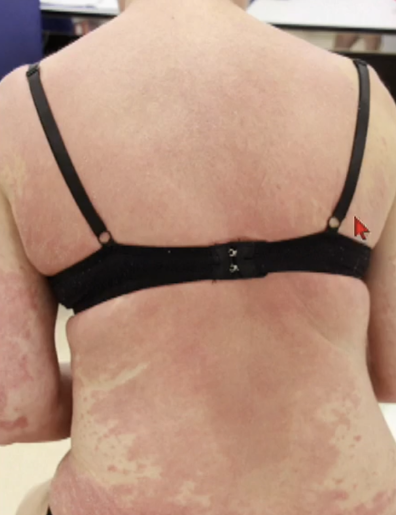{group="cutaneous"}

{group="cutaneous"}

{group="cutaneous"}

{group="cutaneous"}
:::
*Images: Kathrin Hoffmeier Sherer, M.D., University of Basel*

### Urticaria and Angioedema

Immediate IgE-mediated reactions result from the interaction of drug antigens with preformed drug-specific IgE antibodies bound to mast cells or basophils. They usually occur within 1 hour of drug administration but may occur up to 6 hours later, and clinically manifest as urticaria, angioedema, rhinitis, bronchospasm, or anaphylaxis.

::: {layout-ncol=2}
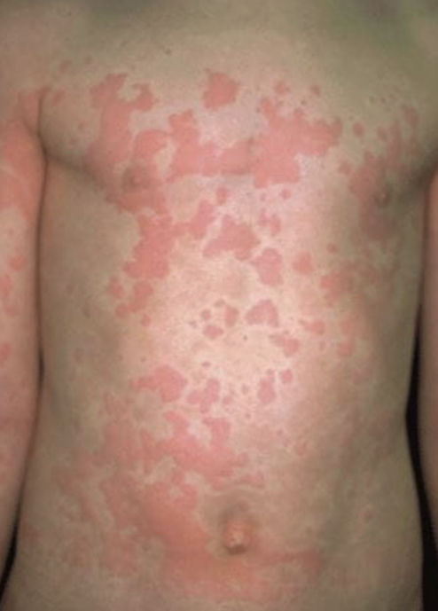{group="urticaria"}

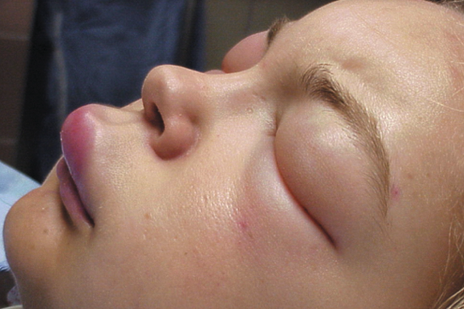{group="urticaria"}
:::
*Images: Kathrin Hoffmeier Sherer, M.D., University of Basel*

### Fixed Drug Eruption

Fixed drug eruptions (FDEs) are sharply circumscribed, annular, erythematous plaques that develop hours after exposure to a culprit drug, resolve spontaneously with residual hyperpigmentation, and are reproducible with subsequent drug exposure. Antibiotics, especially cotrimoxazole, are frequently incriminated. Bullous FDE may resemble erythema multiforme.

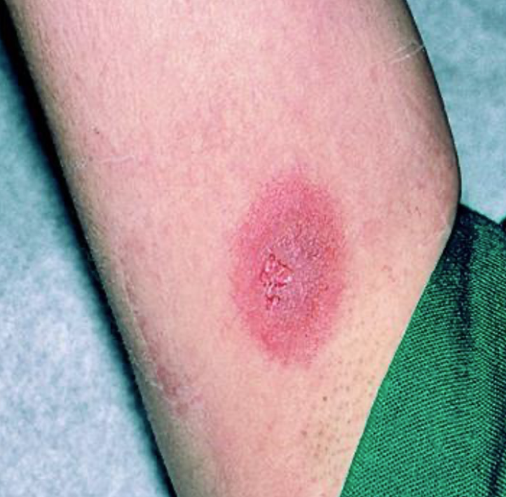{#fig-fde fig-align="center" width="60%"}

## Severe Cutaneous Adverse Reactions (SCAR) {#sec-scar}

### Stevens-Johnson Syndrome / Toxic Epidermal Necrolysis (SJS/TEN)

SJS/TEN is a life-threatening drug reaction characterized by blistering skin and mucosal erosions with an annual incidence rate of 1 to 5 per million individuals. SJS and TEN represent the same underlying disease spectrum classified according to body surface area involvement—SJS affecting <10%, SJS/TEN overlap 10% to 30%, and TEN >30% of the skin surface.

Drug-sensitized cytotoxic CD8+ T cells mediate keratinocyte necrosis through the release of cytolytic peptides such as perforin, granzyme, and granulysin. TEN has a mortality rate of approximately 30% that can exceed 50% in elderly or immunosuppressed patients. The severity-of-illness score for TEN (**SCORTEN**) algorithm facilitates clinical diagnosis and prognostication.

SJS is associated with the maintenance of long-lasting tissue-resident memory T-cell responses in the skin that persist after SCAR, necessitating accurate identification and **lifelong avoidance** of the culprit antibiotic.

::: {layout-ncol=2}
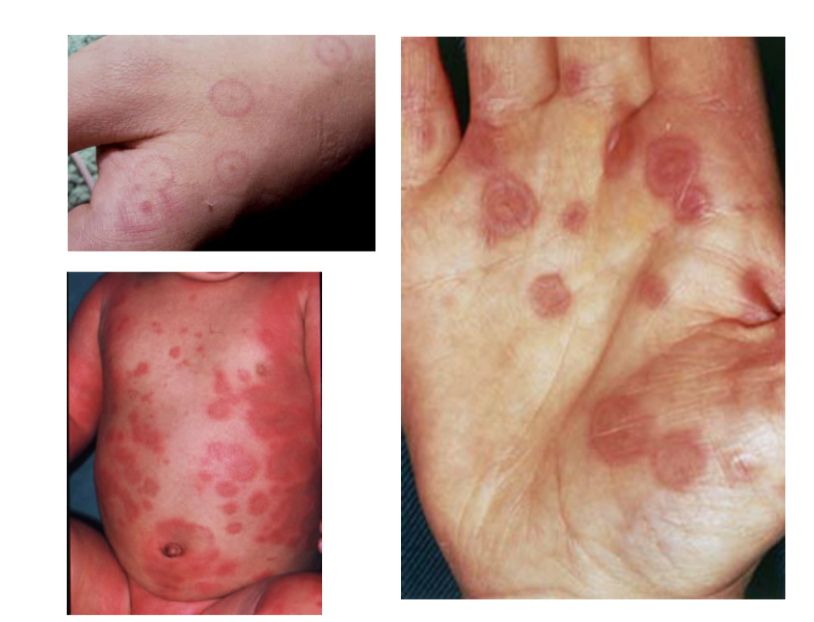{group="scar"}

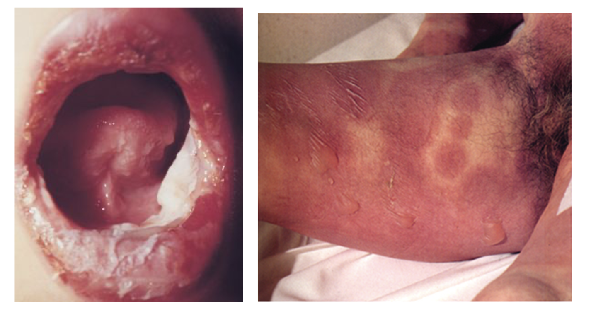{group="scar"}
:::
*Images: Kathrin Hoffmeier Sherer, M.D., University of Basel*

### DRESS: Drug Rash with Eosinophilia and Systemic Symptoms

DRESS (also known as drug-induced hypersensitivity syndrome, DHS or DiHS) is a systemic reaction distinguished from other antimicrobial reactions by a delayed appearance after a 2- to 8-week exposure to several antibiotics, including sulfonamides and vancomycin.

**Key clinical features:**

- **Latency:** 2–8 weeks
- **Non-specific symptoms:** Fever (75%), lymphadenopathy (55–65%)
- **Hematological abnormalities:** Eosinophilia >700/mcL (85–95%), leukocytosis (95%), atypical lymphocytosis (35–67%)
- **Visceral involvement:** Liver (53–90%), pulmonary (30%), cardiac (2–20%)
- **Pathophysiology:** Type IV T-cell activation (CD4+/CD8+) producing TNF-α; reactivation of Herpesviridae family viruses (HHV-6, HHV-7, EBV, CMV) occurs in up to 75% of patients
- The **RegiSCAR** scoring system is a commonly used tool for diagnosis

::: {.callout-warning}
## Important
DRESS reactions may worsen or recur despite drug discontinuation, and symptoms may persist requiring immunosuppressive treatment.
:::

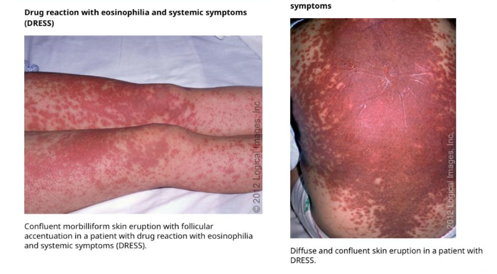{#fig-dress fig-align="center" width="80%"}

**Classic "high-risk" drugs for DRESS:** Allopurinol, aromatic antiepileptic agents (carbamazepine, phenytoin, lamotrigine), sulfonamides, vancomycin, minocycline, nevirapine, anti-tuberculosis drugs, mexiletine. **β-lactams are considered lower risk.**

### Acute Generalized Exanthematous Pustulosis (AGEP)

AGEP is a drug eruption characterized by an extensive sterile, nonfollicular pustular reaction superimposed on erythematous plaques, with a prominent leukocytosis and neutrophilic dominance. Most cases of antimicrobial-induced AGEP (e.g., β-lactams and quinolones) typically cause symptoms within a day of exposure, whereas other drugs take 7 to 14 days [@zhang.liu_2015].

::: {layout-ncol=2}
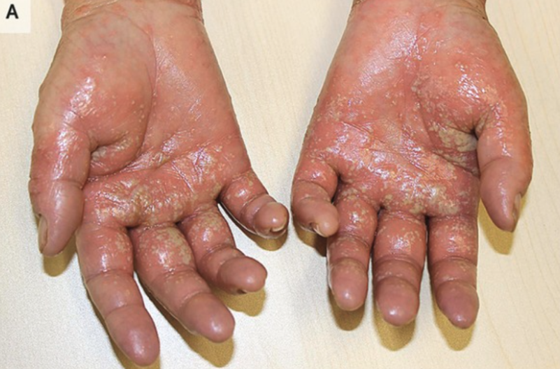{group="agep"}

![AGEP pustular reaction [@zhang.liu_2015]](images/agep.png){group="agep"}
:::

## Penicillin Allergy {#sec-pcn}

### Epidemiology

- 10–20% of patients will report a history of an allergy to penicillin therapy
- However, only **0.5%–2%** of all penicillin administrations actually result in hypersensitivity reactions, most often rash (of these, only 1% are IgE-mediated)
- The incidence of IgE-mediated penicillin allergies is decreasing, partially due to reduced use of parenteral penicillin
- **UK statistics (1972–2007):** Only 1 death after anaphylaxis with oral amoxicillin over 35 years and 100 million treatment courses
- The prevalence of self-reported penicillin allergy is high (10% to 15% among hospitalized patients), yet up to **98% of patients** with a history of penicillin allergy are negative on investigation
- IgE-mediated sensitivity has been documented to wane over time, to **less than 20% by 10 years** after the reaction

### Public Health Implications

Addressing the label of penicillin allergy has emerged as a significant public health risk. Patients with reported penicillin allergy have been shown to have a 51% increased risk of developing surgical site infections, primarily related to the substitution of non–β-lactam prophylactic antibiotics for cephalosporins. Average savings of $297 per patient are estimated with a switch from a non–β-lactam antibiotic to a β-lactam antibiotic, and increased use of non–β-lactam antibiotics leads to increased methicillin-resistant *Staphylococcus aureus* and vancomycin-resistant *Enterococcus*, as well as longer average hospital stay.

![Public health implications of unverified penicillin allergy labels, including downstream effects on antimicrobial stewardship, healthcare costs, and patient outcomes [@castells.etal_2019].](images/public.png){#fig-public fig-align="center" width="90%"}

### Common Myths about Penicillin Allergy

::: {.callout-important}
## Top 4 Patient Penicillin Allergy Myths

1. **"Once you have a penicillin allergy, you have it for life"** — Allergy wanes over time; 80% of patients with type I (IgE-mediated) reactions will not have an allergy after a 10-year period

2. **Viral rashes mistaken for antibiotic allergy** — Pediatric studies have reported >90% of children who developed rashes on antibiotic therapy do not develop a rash when rechallenged with penicillin

3. **Adverse effects mistaken by the patient as drug allergy** — e.g., diarrhea, stomach cramps are not allergic reactions

4. **"I have a family history of penicillin allergy"** — No genetic basis has been identified for penicillin allergies
:::

### Approach to the Patient: Who Needs Testing?

When a patient reports a penicillin allergy, clinicians should determine whether the patient falls into the small minority who truly need allergy evaluation or the vast majority who can tolerate penicillins:

| **~5% Need Allergy Evaluation** | **~95% Can Tolerate Penicillins** |
|---|---|
| Recent history of true IgE-type reaction | Delayed, benign rash (Type IV) that often does not recur |
| Blistering rash | True IgE reactions wane over time (80% tolerant after 10 years) |
| Hemolytic anemia | Never truly allergic (concurrent viral infection, GI distress) |
| Nephritis, hepatitis | |
| Fever and joint pain | |
| SCAR (SJS/TEN, DRESS, AGEP) | |

### Taking a Penicillin Allergy History

The clinical history is integral in evaluating the likelihood of a drug allergy. Key information to obtain includes:

- How long ago did the reaction occur?
- Timing of the reaction in relation to drug administration
- Symptoms and evolution of the reaction
- Description of cutaneous symptoms (morbilliform, urticarial, bullous)
- Involvement of mucosal surfaces or internal organs
- Treatment administered, response, and duration of reaction
- History of prior exposure to the implicated agent
- Other medications ingested at the time of the reaction
- Was the medication or similar medications taken (and tolerated) thereafter?
- Are there potential confounders (e.g., underlying infections)?
- The likelihood of future need of the medication

![Decision framework for evaluating penicillin allergy history and determining the appropriate management pathway [@shenoy.etal_2019].](images/history.png){#fig-history fig-align="center" width="90%"}

### Timing and Clinical Presentation

![Timing and clinical presentation of allergic reactions to penicillin, distinguishing immediate from delayed reactions and their associated clinical features [@shenoy.etal_2019].](images/contraindications.png){#fig-timing fig-align="center" width="70%"}

### Risk Stratification

![Risk assessment algorithm for patients reporting penicillin allergy, stratifying patients into low, medium, and high risk categories based on history [@shenoy.etal_2019].](images/risk.png){#fig-risk fig-align="center" width="90%"}

### PEN-FAST Clinical Decision Rule

The PEN-FAST clinical decision rule uses 3 clinical criteria to stratify penicillin allergy risk:

- **P**enicillin allergy **P**henotype
- **E**lapsed time since reaction
- **N**eed for treatment / **F**eatures of **A**naphylaxis / **S**evere / **T**iming

![The PEN-FAST clinical decision rule scoring system and interpretation for risk stratification [@trubiano.etal_2020]. A total score is calculated, with higher scores indicating greater risk of true allergy.](images/penfast.png){#fig-penfast fig-align="center" width="60%"}

![PEN-FAST performance characteristics showing sensitivity, specificity, and predictive values for identifying true penicillin allergy [@trubiano.etal_2020].](images/penfast_perf.png){#fig-penfastperf fig-align="center" width="90%"}

## Diagnostic Testing and Drug Challenges

### Direct Oral Amoxicillin Challenge

Only approximately 2% of penicillin "allergic" individuals develop an acute hypersensitivity reaction with an oral challenge of a therapeutic dose and 1 hour of observation. An additional approximately 2% will have a delayed onset, typically benign, rash within the next 5 days. Hence, a direct oral challenge with a single therapeutic dose of amoxicillin is an important step to avoid unnecessary penicillin allergy labels, and is indicated in low-risk phenotypes and nonanaphylactic symptoms [@macy.etal_2023].

![Direct oral amoxicillin challenge protocol for low-risk patients with reported penicillin allergy [@macy.etal_2023].](images/amox_challenge.png){#fig-amoxchallenge fig-align="center" width="90%"}

### The PALACE Study

The PALACE randomized clinical trial validated the efficacy of the PEN-FAST clinical decision rule to enable direct oral challenge in patients with low-risk penicillin allergy, confirming that direct oral amoxicillin challenge is safe and effective in appropriately selected low-risk patients [@copaescu.etal_2023].

![Results from the PALACE randomized clinical trial demonstrating the safety and efficacy of direct oral challenge guided by the PEN-FAST decision rule [@copaescu.etal_2023].](images/Palace.png){#fig-palace fig-align="center" width="90%"}

### Two-Step Oral Amoxicillin Challenge

For patients with medium-risk histories, a two-step graded oral challenge approach may be used. A common protocol for immediate reactions is to start with 1/10th of the therapeutic dose, followed by the final dose with 30–60 minutes of observation between steps.

![Two-step oral amoxicillin challenge protocol for medium-risk patients [@macy.etal_2023].](images/2step.png){#fig-2step fig-align="center" width="90%"}

### Anaphylaxis Emergency Medications

![Emergency medications and dosing for anaphylaxis management during drug challenge procedures [@macy.etal_2023].](images/anaphylaxis.png){#fig-anaphylaxis fig-align="center" width="70%"}

### Skin Testing

Penicillin skin testing is an excellent diagnostic tool in patients with a history of anaphylaxis or a recent IgE-mediated reaction:

- **High negative predictive value (NPV) ~95–97%** for IgE-mediated reactions
- **Poor positive predictive value** — possible false-positive diagnosis if used in patients with low pre-test probability
- Amoxicillin is commonly used to challenge after negative penicillin skin tests (NPV approaches **100%** if both are negative)
- Traditional skin testing may be negative in patients with historical reactivity to piperacillin-tazobactam
- **Penicillin skin testing has NO value in delayed reactions**, including SJS/TEN, DRESS, and other noncutaneous organ-based reactions

![Penicillin skin testing procedure and interpretation, including prick and intradermal testing with major and minor determinants [@macy.etal_2023].](images/skintest.png){#fig-skintest fig-align="center" width="90%"}

### Allergenic Determinants

Two major mechanisms have been implicated in allergic reactions to β-lactams: IgE-dependent responses and T-cell–mediated reactions. Rapid and stable cleavage of the β-lactam ring results in the generation of defined epitopes that act as haptens. The major determinant derived from the β-lactam ring is known as benzylpenicilloyl (accounting for 95% of haptenated penicillin), and there are also minor determinants [@castells.etal_2019].

::: {layout-ncol=2}
![Major penicillin determinants [@castells.etal_2019]](images/penicillins.png){group="determinants" width="200"}

![Minor penicillin determinants [@castells.etal_2019]](images/minor.png){group="determinants" width="200"}
:::

### Skin Test Assessment for Medium-Risk Patients

A negative skin test is associated with a 95% NPV for penicillin allergy. A negative skin test plus negative amoxicillin challenge approaches 100% NPV. If the skin test is positive, amoxicillin challenge is not considered and the patient should be referred to an allergist/immunologist, or desensitization considered [@macy.etal_2023].

![Comprehensive skin test assessment and management algorithm for medium-risk patients with reported penicillin allergy [@macy.etal_2023].](images/medium%20risk.png){#fig-mediumrisk fig-align="center" width="90%"}

![Penicillin skin test assessment algorithm showing decision pathways based on test results [@macy.etal_2023].](images/skintest2.png){#fig-skintest2 fig-align="center" width="90%"}

## Drug Challenges

A drug challenge is generally accepted as the reference standard to establish tolerance to a drug. Drug challenges are recommended when a true drug allergy is deemed unlikely based on the history and available diagnostic tests.

**For immediate reactions:** Challenges are performed in a graded fashion with escalated dosing every 30 to 60 minutes. A common protocol is to start with 1/10th of the therapeutic dose, followed by the final dose.

**For delayed reactions:** Protocols vary from days to weeks. Similar to immediate drug challenges, dose escalation starts at 1/10th of the final dose, but the interval may be 2 to 3 days or a week.

::: {.callout-warning}
## Contraindications to Drug Challenges
Noncutaneous-based reactions (e.g., hepatitis, cytopenias, pneumonitis), drug-induced vasculitis, bullous eruptions, and **SCARs** (SJS/TEN, DRESS, AGEP). In patients with a history of life-threatening anaphylaxis, drug challenge should be performed only after establishing the benefit-to-risk ratio. Equipment to treat anaphylactic reactions must be readily available, including epinephrine.
:::

## Desensitization {#sec-desensitization}

In drug-allergic patients for whom no therapeutic alternative exists, a procedure to induce temporary drug tolerance can be considered. Key principles:

- Progressive, graded de-granulation of mast cells (histamine release) and internalization of high-affinity IgE receptors by administering graded doses of antibiotic
- Desensitization procedures actively induce tolerance through mechanisms that are still unclear but may involve internalization of high-affinity IgE receptors
- The "desensitized" state is **transient** — if the patient does not receive a dose for >4 drug half-lives, the prior hypersensitive state returns and repeat desensitization is required

::: {.callout-caution}
## Contraindications for Desensitization
Desensitization is **contraindicated** in patients with a history of penicillin-induced exfoliative dermatitis, Stevens-Johnson syndrome, or toxic epidermal necrolysis. Desensitization has no effect on the incidence of non-IgE-mediated reactions such as serum sickness, hemolytic anemia, maculopapular rashes, drug fever, hepatitis, or interstitial nephritis.
:::

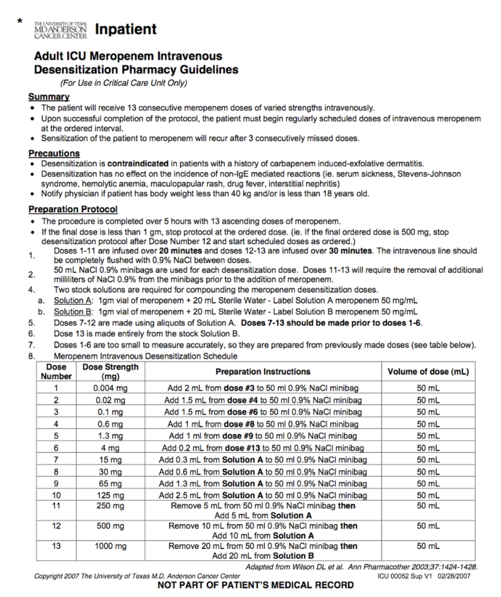{#fig-desensitization fig-align="center" width="50%"}

## Cross-Reactivity Between β-Lactams {#sec-crossreactivity}

### Correcting a Common Misconception

Common teaching states that if a patient has a documented penicillin allergy, the risk of cross-reactions with cephalosporins is 10%. **This is false** — the actual cross-reactivity is more likely **2%–3%**. Cross-reactivity is primarily determined by the R1 sidechain of the molecule, and cefazolin has a unique side chain with very low risk for cross-reactivity.

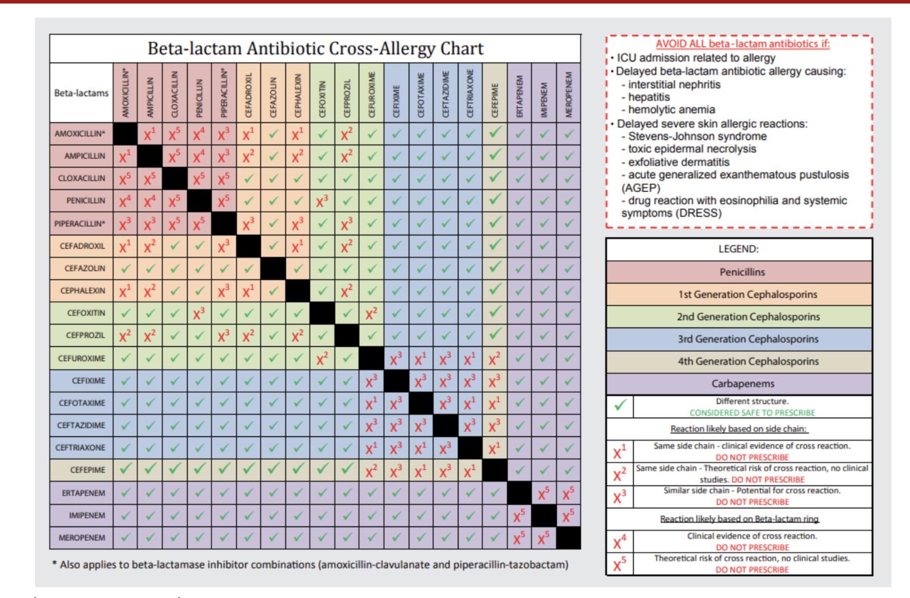{#fig-crossreact fig-align="center" width="70%"}

### β-Lactams with Common Side Chains

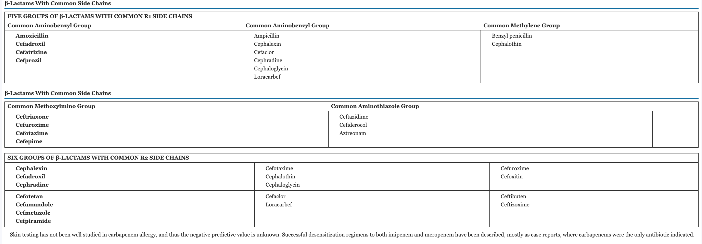{#fig-sidechains fig-align="center" width="90%"}

### Carbapenems and Monobactams

- Cross-reactivity with penicillin allergy and carbapenems is **less than 1%**
- **No cross-reactivity** between penicillins and monobactams (aztreonam)
- A graded challenge or test dose can be considered (i.e., infuse 5–10% of dose and observe, then progress to full dose if no reaction)

### CEPHTEST: Applying PEN-FAST to Cephalosporin Allergies

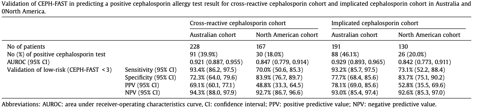{#fig-cephtest fig-align="center" width="90%"}

## Special Populations for Testing

Certain patient populations benefit particularly from penicillin allergy testing:

- **Peri-procedure before elective surgery:** Importance of antibiotic timing/tissue levels at time of incision (less optimal with vancomycin which requires longer infusion)
- **Pregnancy:** Penicillin allergy is associated with increased risk of cesarean delivery, post-cesarean wound complications, and longer length of stay. Consider third-trimester referral for testing
- **Long-term care facilities:** Non-beta-lactam therapies have higher risk for drug interactions and adverse effects
- **Hematology-oncology:** Consider testing before chemotherapy or transplant (onset of immunosuppression)
- **STD clinics**
- **ICU patients** (emerging area of investigation)

## Non-Penicillin Antibiotic Allergies {#sec-nonpcn}

### General Principles

The same principles of allergy evaluation apply: patient history is the cornerstone. Key information includes the drugs the patient was taking, exact sequence of events, underlying disease, concomitant infections and medications, and clinical morphology of the rash at several time points.

### Intradermal Testing for Non-Beta-Lactams

Skin tests for most antimicrobial agents lack high negative predictive values, and skin test positivity is often a function of the time elapsed since the index reaction. Prick and intradermal tests are less well standardized, and some antibiotics are irritating even at low concentrations.

Special cellular activation tests may be available in some centers:

- **Basophil Activation Test (BAT):** Flow cytometry detects upregulation of activation markers CD63 and CD203c on the surface of basophils after incubation with the implicated drug

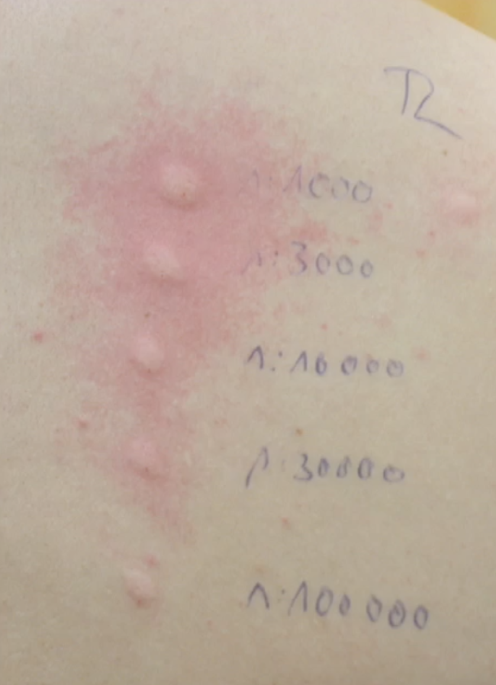{#fig-intradermal fig-align="center" width="60%"}

### Delayed-Type Hypersensitivity Testing

::: {layout-ncol=2}
::: {}
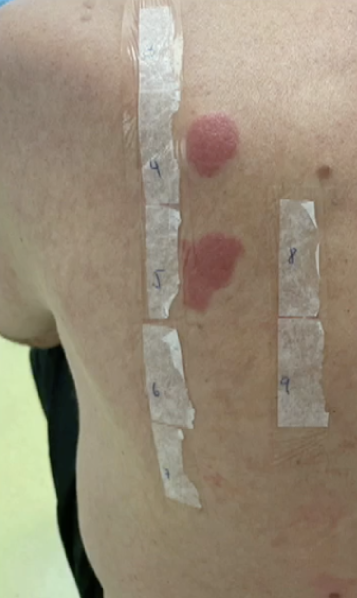{group="delayed"}
:::
::: {}
**Intradermal or Patch Testing (reading at 24–72 hours):**

- Low sensitivity, high specificity
- Patch tests are safe in patients with SCARs and have the highest sensitivity for DRESS (32%–80%) and AGEP (58%–64%)
- Delayed intradermal tests have low sensitivity for SJS/TEN and should be avoided

**Lymphocyte Transformation Testing:**

- Available in specialized laboratories
- Haptenization to become an antigen in vivo is hard to imitate in the lab
:::
:::

### Sulfonamide Hypersensitivity

Sulfonamide allergy has an incidence of approximately 8%, primarily manifesting as cutaneous and GI tract reactions. Only 3% are considered true hypersensitivity reactions, with the most common presentations being limited exanthems and fixed drug eruptions. However, sulfonamides are disproportionately associated with infrequent severe side effects (SJS/TEN, DRESS).

Mechanisms may include IgE-mediated reactions, but other poorly understood direct T-cell mediated mechanisms are more likely responsible. There is a higher incidence of reactions in patients with HIV/AIDS and tuberculosis.

![Mechanism of sulfonamide hypersensitivity showing the metabolic pathways and immune activation cascades involved [@slatore.tilles_2004].](images/sulfallergy.png){#fig-sulfa fig-align="center" width="90%"}

![Application of the PEN-FAST scoring approach to sulfonamide allergies for risk stratification and management [@waldron.etal_2023].](images/sulfast.png){#fig-sulfast fig-align="center" width="90%"}

### Non-Sensitizing (Pseudoallergic) Reactions

Some drug reactions are caused by direct (IgE-independent) activation of mast cells through the **Mas-related G protein–coupled receptor (MRGPRX2)**, and can cause reactions clinically indistinguishable from IgE-mediated reactions [@ebo.etal_2019]. Drugs associated with this pathway include:

- Neuromuscular blocking agents
- Opioids
- Radiocontrast media
- Vancomycin, glycopeptides, fluoroquinolones
- **Complement-activation-related pseudoallergy (CARPA):** liposomes, drug carriers

![Mechanisms of non-sensitizing allergic reactions through the MRGPRX2 receptor pathway [@ebo.etal_2019].](images/receptors.png){#fig-receptors fig-align="center" width="70%"}

### Vancomycin Infusion Reaction

Vancomycin infusion reaction (historically known as "red man syndrome") is a common non-IgE-mediated reaction caused by direct mast cell degranulation through MRGPRX2. Management involves slowing the infusion rate and administering antihistamines [@alvarez-arango.etal_2021].

Vancomycin can also cause: hypotension, anaphylaxis, maculopapular exanthems, vasculitis, eosinophilia, exfoliative dermatitis/DRESS/SJS.

![Vancomycin infusion reaction clinical presentation [@alvarez-arango.etal_2021].](images/redman.png){#fig-redman fig-align="center" width="70%"}

## Take-Home Messages

::: {.callout-tip}
## Key Points

1. **Penicillin allergies** are the most common "contraindication" to antibiotic therapy, but most histories do not represent true allergies
2. A **systematic approach** can be used to evaluate and potentially "de-label" patients with penicillin allergy using tools like the PEN-FAST score
3. **Cross-reactivity rates are low** with current cephalosporins (~2–3%) and carbapenems (<1%), but can be addressed through antibiotic challenges and skin testing
4. **Desensitization** can be attempted in specific cases when a particular antibiotic is needed for IgE-mediated reactions, but is contraindicated in SCAR
5. Some antibiotics cause **non-immune-related hypersensitivity reactions** (via MRGPRX2) that can be managed by slowing infusions and administering antihistamines
6. **Delabeling strategies** are critical to optimal antibiotic stewardship and can improve clinical outcomes
:::

## References {.unnumbered}

::: {#refs}
:::

---

*Course materials available at: [www.padovaid.com](https://padovaid.com/)*

*Contact: russelledward.lewis@unipd.it | GitHub: [https://github.com/Russlewisbo](https://github.com/Russlewisbo)*
